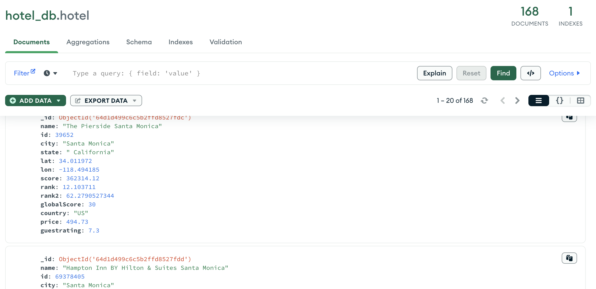
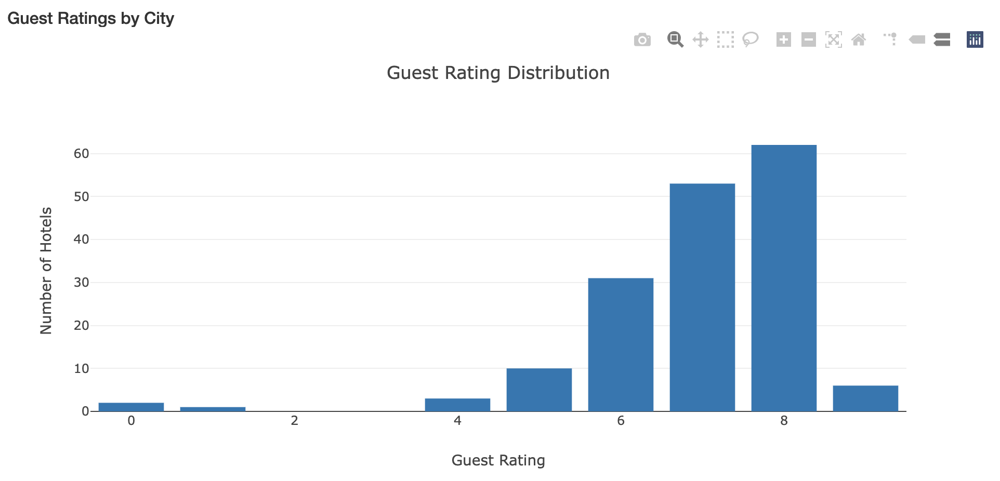
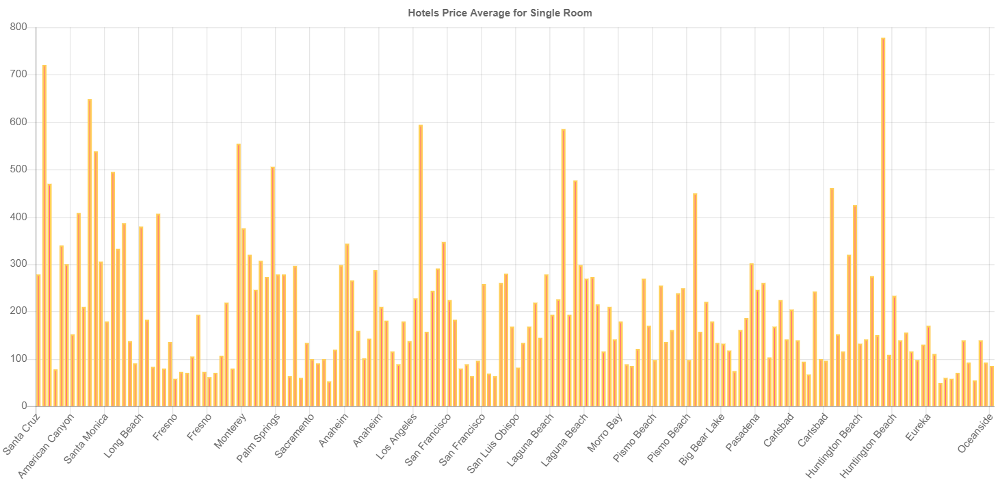
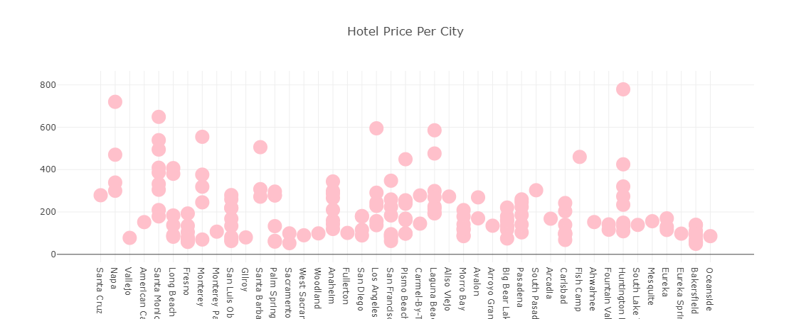

# California Vacation Destinations Dashboard

Welcome to the California Vacation Destinations Dashboard! This interactive dashboard allows you to explore vacation destinations across California based on hotels, their ratings, and pricing. You can select one of the four largest cities in California and instantly see valuable insights through various interactive charts and visualizations.

## Result Dashboard

gitpage url :

## Table of Contents

- [Introduction](#introduction)
- [Data Summary](#data-summary)
- [Task Breakdowns](#task-breakdowns)
- [Usage](#usage)
- [Charts and Visualizations](#charts-and-visualizations)
- [Contributors](#contributors)

## Introduction

The California Vacation Destinations Dashboard is designed to help you make informed decisions about your vacation plans by providing detailed information about hotels, their ratings, and pricing in the four largest cities of California. With just a few clicks, you can explore the top hotels, their ratings, and even visualize the distribution of ratings and pricing across different hotels.

## Data Summary

Initially, we initiated our exploration by leveraging the Priceline API to gather an extensive compilation of hotels across 30 sought-after cities in California.

https://pricelinepartnersolutions.com/developers/getting-started

 Ensuring data accuracy, we meticulously curated the dataset, rigorously validating each entry to confirm its presence within the United States. This meticulous curation process yielded a refined collection of hotels, setting the stage for our subsequent analyses. Subsequently, we conducted further API inquiries to retrieve both hotel pricing and guest ratings. While some price data was absent, our comprehensive efforts yielded a consolidated dataset comprising 168 pristine entries. This distilled dataset, an exemplar of our commitment to precision, was meticulously preserved in a JSON format and securely stored within a MongoDB database. This curated dataset now stands as a robust foundation for our subsequent analytical endeavors, ready to unveil valuable insights into California's vacation destinations.

## Task Breakdowns

Data Wrangling and Database (MongoDB) (JongWook): JongWook will handle data wrangling tasks, ensuring that the retrieved data is cleaned and formatted appropriately. They will also set up the MongoDB database for storing the data.

Flask API (Steph): Steph will handle the Flask API setup, including connecting to the Priceline API, retrieving data, and serving it to the frontend.

Hotel Chart (Alexis): Alexis will design and develop the table that displays the top 5 hotels within a radius of the selected city, including hotel names, addresses, and scores.

Dropdown Menu, Bar Chart (Taylor): Taylor will implement the dropdown menu for city selection and create the bar chart showing the distribution of hotel ratings within a radius of the selected city.

Bubble Graph (Caleigh): Caleigh will be responsible for creating the bubble graph that depicts the prices for different hotels within a certain radius of the center of the selected city.

## Usage

Select a City: Choose one of the four largest cities in California from the dropdown menu.
Explore Charts: Instantly see the hotels, distribution of ratings, and pricing for the selected city.

## Charts and Visualizations

Hotels Table: This table displays the hotels within the selected city. It provides details such as hotel names, addresses, and scores.

Ratings Distribution Bar Chart: This bar chart visualizes the distribution of hotel guest ratings within a radius of the selected city. The ratings are on a scale of 1 to 10.

Hotel Pricing Bubble Graph: This bubble graph depicts the prices for different hotels within a certain radius of the center of the selected city.

Landmark Map (Possible Add-On): This map tile shows the location of each landmark in the selected city. This feature is a potential add-on to enhance your vacation planning.

## Contributors

* Alexis Rangel : 
* Caleigh Teahan : 
* JongWook Choe : 
* Stephanie Loomer : 
* Taylor Ward : 
